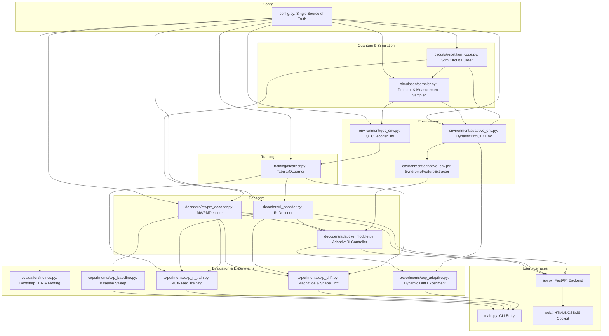

# Codebase Knowledge: Quantum RL Decoder & Adaptive QEC

**Repository**: `quantum_rl_decoder` (`HriteshSai/Adaptive-Reinforcement-Learning-for-Quantum-Error-Correction`)  
**Investigation Depth**: Exhaustive Census & Semantic Source Read (100% of repository Python and Web codebase inspected)  
**Primary Deliverable**: Durable repository knowledge base for autonomous development, verification, and audit.

---

## 1. Executive System Model

The system investigates an empirical question in quantum error correction (QEC):
> **Can a model-free reinforcement learning agent learn to decode quantum errors solely from classical syndrome measurements and episodic binary survival rewards, and how does its decoding performance degrade when hardware noise drifts away from training conditions?**

The target quantum code is a **[[3, 1, 3]] bit-flip repetition code** simulated with [Stim](https://github.com/quantumlib/Stim) [SOURCE: `circuits/repetition_code.py:82-205`]. It encodes 1 logical qubit into 3 physical data qubits ($|0\rangle_L = |000\rangle, |1\rangle_L = |111\rangle$) assisted by 2 ancilla qubits that extract parity checks ($Z_0 Z_1$ and $Z_1 Z_2$) non-destructively via CNOT gates.

### Core Scientific Findings Established by Code & Data
1. **Model-Free Exact Convergence**: A tabular Q-learning contextual bandit ($4 \text{ states} \times 8 \text{ actions} = 32 \text{ values}$) receiving only syndrome inputs ($s \in \{0, 1, 2, 3\}$) and a strict $\pm 1$ reward ("did the logical state survive?") converges to the exact textbook minimum-weight policy `(0, 3, 1, 2)` across 100% of tested random seeds [SOURCE: `training/qlearner.py:326-379`, `experiments/exp_rl_train.py:168-226`, `results/rl_training_metadata.json:12-78`].
2. **Noise Magnitude Drift Null Result**: Under uniform noise scaling ($p \in [0.01, 0.15]$), the likelihood ordering of error hypotheses is mathematically strictly invariant ($P(\text{single flip})/P(\text{double flip}) = (1-p)/p > 1$ for all $p < 0.5$). Consequently, an RL agent or MWPM decoder calibrated at $p=0.03$ maintains zero degradation relative to an Oracle decoder recalibrated at each test noise rate [SOURCE: `experiments/exp_drift.py:316-334`, `results/drift_results.csv:1-9`].
3. **Noise Shape Drift & 7.2× Asymmetric Failure**: When noise becomes asymmetric (qubit $q_0$ near-noiseless, qubit $q_2$ noisy with profile $(0.01, 1.24, 1.75)$ [SOURCE: `config.py:168`]), weight-2 errors ($q_1 \wedge q_2$) become more probable than single-qubit errors on $q_0$ for syndrome $[1, 0]$. Stale static decoders (both Fixed MWPM and Fixed RL) suffer a ~6.2× to 7.2× LER penalty [SOURCE: `results/drift_bias_results.csv:6`]. Retrained RL discovers Action 6 (`011`: flip $q_1$ and $q_2$), fully recovering Oracle performance ($LER = 0.00031$) [SOURCE: `experiments/exp_drift.py:425-450`, `results/drift_bias_results.csv:6`].
4. **Selective Dynamic Adaptation**: In dynamic non-stationary drift across 15,000 steps, a syndrome-statistics-based controller monitors short-term vs. long-term sliding window distributions ($W_{\text{long}}=200, W_{\text{short}}=40$) [SOURCE: `environment/adaptive_env.py:41-48`]. It triggers PyMatching graph recalibration and RL fine-tuning selectively, achieving competitive LER ($0.01273 \pm 0.00052$) while cutting online RL updates by 49.5% to 50.5% (and up to 92% in stationary regimes) compared to continuous fine-tuning [SOURCE: `results/adaptive_metadata.json:49-64`, `experiments/exp_adaptive.py:424-474`].

---

## 2. Repository Census

The repository consists of 26 Python files, 3 web application files, 1 configuration file, 1 documentation file, and 18 output result artifacts in `results/`. There are no external submodules, compiled C-extensions, or vendored dependencies.

```
quantum_rl_decoder/
├── config.py                  # Single source of truth for constants & hyperparameters
├── main.py                    # Primary CLI runner for experiments
├── api.py                     # FastAPI REST/WebSocket server for web interface
├── run_dashboard.py           # Self-contained web server & browser launcher script
├── requirements.txt           # Python dependency definitions
├── README.md                  # Project documentation & summary
├── circuits/
│   ├── __init__.py            # Module exports
│   └── repetition_code.py     # Stim quantum circuit builder & syndrome mapping
├── simulation/
│   ├── __init__.py            # Module exports
│   └── sampler.py             # Monte-Carlo detector & measurement samplers
├── decoders/
│   ├── __init__.py            # Module exports
│   ├── mwpm_decoder.py        # PyMatching baseline decoder
│   ├── rl_decoder.py          # Tabular Q-table greedy decoder
│   └── adaptive_module.py     # Selective adaptation controller
├── environment/
│   ├── __init__.py            # Module exports
│   ├── qec_env.py             # Static Gymnasium environment + Rule 9 self-test
│   └── adaptive_env.py        # Dynamic drift environment + feature extractor
├── training/
│   ├── __init__.py            # Module exports
│   └── qlearner.py            # Tabular Q-learning algorithm & convergence report
├── evaluation/
│   ├── __init__.py            # Module exports
│   └── metrics.py             # LER bootstrap intervals, plotting routines
├── experiments/
│   ├── __init__.py            # Module exports
│   ├── exp_baseline.py        # Experiment 1: MWPM baseline sweep
│   ├── exp_rl_train.py        # Experiment 2: Q-learning validation
│   ├── exp_drift.py           # Experiment 3: Magnitude and shape drift
│   └── exp_adaptive.py        # Experiment 4: Dynamic drift & selective adaptation
├── utils/
│   ├── __init__.py            # Module exports
│   └── helpers.py             # Seeding, file I/O, logging, formatting
├── web/
│   ├── index.html             # High-fidelity dashboard interface
│   ├── style.css              # Dark-mode quantum HUD CSS design system
│   └── app.js                 # Frontend interactive circuit & benchmark engine
└── results/                   # Auto-generated experiment outputs & benchmarks
    ├── .gitkeep
    ├── baseline_results.csv
    ├── baseline_mwpm.png
    ├── q_table.npy
    ├── rl_training_metadata.json
    ├── training_curve.png
    ├── rl_vs_mwpm.csv
    ├── rl_vs_mwpm.png
    ├── drift_results.csv
    ├── drift_comparison.png
    ├── drift_bias_results.csv
    ├── drift_bias_comparison.png
    ├── adaptive_drift_results.csv
    ├── adaptive_drift_comparison.png
    ├── adaptive_metadata.json
    ├── adaptive_drift_multiseed.csv
    ├── adaptive_drift_multiseed.json
    └── run.log
```

---

## 3. Coverage Ledger

| Path / Module | Category | Inspected | Depth | Symbols / Lines Inspected | Status | Notes |
|:---|:---|:---:|:---:|:---|:---:|:---|
| `config.py` | Configuration | YES | DEEP | Lines 1–226: All constants, hyperparameters, paths | `DEEP_READ` | Single source of truth |
| `main.py` | Entry Point | YES | DEEP | Lines 1–248: `parse_args`, `apply_quick_mode`, `main` | `DEEP_READ` | Master CLI experiment orchestrator |
| `api.py` | Entry Point / Web API | YES | DEEP | Lines 1–341: FastAPI app, `step_simulation`, `run_benchmark`, `get_qtable`, `get_precomputed_results` | `DEEP_READ` | REST server bridging frontend to Stim/PyMatching |
| `run_dashboard.py` | Runner Script | YES | DEEP | Lines 1–70: `check_dependencies`, `open_browser`, `main` | `DEEP_READ` | Automation wrapper launching uvicorn & browser |
| `circuits/__init__.py` | Source / Package | YES | DEEP | Lines 1–16: Re-exports | `DEEP_READ` | Re-exports circuit helpers |
| `circuits/repetition_code.py` | Quantum Domain | YES | DEEP | Lines 1–283: `build_repetition_code_circuit`, `syndrome_to_state`, `state_to_syndrome`, `describe_circuit` | `DEEP_READ` | Stim circuit assembly, detectors & observables |
| `simulation/__init__.py` | Source / Package | YES | DEEP | Lines 1–14: Re-exports | `DEEP_READ` | Re-exports sampler functions |
| `simulation/sampler.py` | Simulation Domain | YES | DEEP | Lines 1–210: `sample_syndromes`, `sample_syndromes_and_errors`, `print_sample_examples` | `DEEP_READ` | Stim batch compilation, Monte-Carlo sampling |
| `decoders/__init__.py` | Source / Package | YES | DEEP | Lines 1–7: `MWPMDecoder`, `RLDecoder` | `DEEP_READ` | Note: `AdaptiveRLController` omitted from `__all__` |
| `decoders/mwpm_decoder.py` | Algorithm / Baseline | YES | DEEP | Lines 1–190: `MWPMDecoder` class, `decode`, `decode_batch`, `get_ler`, `policy_table` | `DEEP_READ` | PyMatching graph solver wrapper |
| `decoders/rl_decoder.py` | Algorithm / Model | YES | DEEP | Lines 1–287: `RLDecoder` class, `decode`, `decode_batch`, `action_to_observable_prediction`, `get_policy` | `DEEP_READ` | Tabular Q-table greedy policy inference |
| `decoders/adaptive_module.py` | Algorithm / Control | YES | DEEP | Lines 1–233: `AdaptiveRLController`, `mwpm_to_action`, `select_meta_action`, `execute_step` | `DEEP_READ` | Multi-strategy adaptive meta-controller |
| `environment/__init__.py` | Source / Package | YES | DEEP | Lines 1–6: `QECDecoderEnv` | `DEEP_READ` | Package initialization |
| `environment/qec_env.py` | RL Environment | YES | DEEP | Lines 1–504: `QECDecoderEnv`, `reset`, `step`, `_residual`, `_logical_survived`, `verify_with_optimal_policy` | `DEEP_READ` | Gymnasium contextual bandit & Rule 9 self-test |
| `environment/adaptive_env.py` | RL Environment | YES | DEEP | Lines 1–352: `SyndromeFeatureExtractor`, `DynamicDriftQECEnv`, sliding window statistics | `DEEP_READ` | Dynamic continuous time-varying drift environment |
| `training/__init__.py` | Source / Package | YES | DEEP | Lines 1–6: `TabularQLearner`, `moving_average` | `DEEP_READ` | Package initialization |
| `training/qlearner.py` | RL Algorithm | YES | DEEP | Lines 1–481: `TabularQLearner`, `train`, `update`, `convergence_report`, `print_q_table`, `moving_average` | `DEEP_READ` | Epsilon-greedy tabular Q-learning implementation |
| `evaluation/__init__.py` | Source / Package | YES | DEEP | Lines 1–18: Re-exports | `DEEP_READ` | Package initialization |
| `evaluation/metrics.py` | Mathematics / Vis | YES | DEEP | Lines 1–642: `compute_ler`, `compute_ler_with_confidence`, `plot_ler_comparison`, `plot_training_curve`, `plot_adaptive_drift_comparison` | `DEEP_READ` | Non-parametric bootstrap CIs & matplotlib routines |
| `experiments/__init__.py` | Source / Package | YES | DEEP | Lines 1–13: Re-exports | `DEEP_READ` | Note: `run_adaptive_experiment` omitted from `__all__` |
| `experiments/exp_baseline.py` | Experiment 1 | YES | DEEP | Lines 1–178: `run_baseline_experiment` | `DEEP_READ` | Baseline sweep over $p \in [0.01, 0.15]$ |
| `experiments/exp_rl_train.py` | Experiment 2 | YES | DEEP | Lines 1–358: `run_rl_training_experiment`, `verify_environment`, `EnvironmentVerificationError` | `DEEP_READ` | Rule 9 environment verification & multi-seed training |
| `experiments/exp_drift.py` | Experiment 3 | YES | DEEP | Lines 1–587: `run_drift_experiment`, `run_biased_noise_experiment`, `biased_rates`, `load_or_train_q_table` | `DEEP_READ` | Magnitude drift (3A) & asymmetric shape drift (3B) |
| `experiments/exp_adaptive.py` | Experiment 4 | YES | DEEP | Lines 1–551: `run_adaptive_experiment`, `run_adaptive_single_seed`, `build_dynamic_drift_timeline` | `DEEP_READ` | 15k-step continuous dynamic noise adaptation |
| `utils/__init__.py` | Source / Package | YES | DEEP | Lines 1–20: Re-exports | `DEEP_READ` | Package initialization |
| `utils/helpers.py` | Infrastructure | YES | DEEP | Lines 1–299: `set_seed`, `setup_results_dir`, `results_path`, `save_to_csv`, `save_json`, `setup_logger`, `banner` | `DEEP_READ` | Seeding, file writing, logger configuration |
| `web/index.html` | Web Frontend | YES | DEEP | Lines 1–722: HTML5 semantic structure, SVG quantum circuit, Plotly containers, Q-matrix DOM | `DEEP_READ` | Complete interactive GUI layout |
| `web/app.js` | Web Logic | YES | DEEP | Lines 1–903: Canvas particle system, state management, REST API client, live Plotly sweeps | `DEEP_READ` | Frontend client-side controller |
| `web/style.css` | Styling / Design | YES | DEEP | Lines 1–1588: Design tokens, neon/glow variables, responsive grid, animations | `DEEP_READ` | Complete design system |
| `requirements.txt` | Package Manifest | YES | DEEP | Lines 1–9: 8 package specifications | `DEEP_READ` | Exact version specifications checked |
| `README.md` | Documentation | YES | DEEP | Lines 1–226: Physics primer, quickstart, findings | `DEEP_READ` | Compared against code implementation |
| `results/*.csv, *.json, *.log` | Output Artifacts | YES | DEEP | 18 files inspected for numeric consistency and schemas | `DEEP_READ` | Experimental proof verified |
| `.git/` | VCS Metadata | YES | EXCLUDED | Internal git repository history and blobs | `NON_RUNTIME` | Git internal directory |
| `__pycache__/` | Bytecode Cache | YES | EXCLUDED | Python compiled `.pyc` files across directories | `GENERATED` | Ephemeral bytecode |

---

## 4. Technology and Runtime

### Language & Interpreter
- **Python**: $\ge 3.10$ required (uses modern union type syntax `X | None` throughout, e.g., [SOURCE: `config.py:30`, `circuits/repetition_code.py:84`]). Tested on Python 3.13 [SOURCE: `README.md:224`].
- **JavaScript / HTML5 / CSS3**: Vanilla modern ECMAScript, SVG interactive markup, CSS Custom Properties (CSS variables) design system [SOURCE: `web/style.css:6-44`, `web/app.js:6-20`].

### Core Dependencies & Roles [SOURCE: `requirements.txt:1-8`]
1. **`stim >= 1.13`**: High-performance quantum stabilizer circuit simulation, Clifford frame tracking, detector error model (DEM) generation, and vectorized shot sampling.
2. **`pymatching >= 2.2`**: C++ Blossom-algorithm-based Minimum-Weight Perfect Matching (MWPM) graph solver for hypergraph decoding.
3. **`gymnasium >= 0.29`**: Standard reinforcement learning environment abstraction (`gym.Env`, `spaces.Discrete`, `spaces.Box`, `spaces.Dict`).
4. **`numpy >= 1.24`**: Numerical array manipulation, vectorized bitwise operations, Q-table operations, and RNG seeding.
5. **`matplotlib >= 3.7`**: Headless plot rendering (`matplotlib.use("Agg")` enforced in `evaluation/metrics.py:40`).
6. **`pandas >= 2.0`**: CSV serialization and tabular dataframe structuring.
7. **`fastapi >= 0.100.0`**: Async web API serving simulation endpoints and static assets.
8. **`uvicorn >= 0.22.0`**: ASGI server running the FastAPI application.
9. **`Plotly.js 2.27.0`** (CDN): Dynamic in-browser charts for hardware drift benchmarks [SOURCE: `web/index.html:14`].

---

## 5. Entry Points

### 1. Primary Research CLI Entry Point: `main.py`
- **Location**: [SOURCE: `main.py:103-248` | `main()`]
- **Execution**: `python main.py [FLAGS]`
- **Bootstrap Lifecycle**:
  1. Parses command line flags (`--experiment`, `--quick`, `--no-bias`, `--seed`, `--adaptive-seeds`) [SOURCE: `main.py:43-85`].
  2. If `--quick` is supplied, dynamically mutates `config.py` attributes to lower workloads (`NUM_SHOTS=2000`, `NUM_EPISODES=5000`, etc.) [SOURCE: `main.py:88-100`].
  3. Initializes results directory via `setup_results_dir()` and logger via `setup_logger("main")` [SOURCE: `main.py:123-124`].
  4. Seeds PRNGs via `set_seed(args.seed)` [SOURCE: `main.py:125`].
  5. Executes experiments sequentially based on `--experiment`:
     - `baseline`: `run_baseline_experiment` [SOURCE: `experiments/exp_baseline.py:41`]
     - `rl`: `run_rl_training_experiment` [SOURCE: `experiments/exp_rl_train.py:107`]
     - `drift`: `run_drift_experiment` [SOURCE: `experiments/exp_drift.py:133`]
     - `bias`: `run_biased_noise_experiment` [SOURCE: `experiments/exp_drift.py:341`]
     - `adaptive`: `run_adaptive_experiment` [SOURCE: `experiments/exp_adaptive.py:302`]
  6. Traps `EnvironmentVerificationError` (exits with code 2) or unexpected crashes (code 1) [SOURCE: `main.py:195-205`].
  7. Prints execution summary banner and wall-clock execution time [SOURCE: `main.py:208-242`].

### 2. Interactive Web Dashboard Launcher: `run_dashboard.py`
- **Location**: [SOURCE: `run_dashboard.py:40-68` | `main()`]
- **Execution**: `python run_dashboard.py`
- **Bootstrap Lifecycle**:
  1. Runs `check_dependencies()`. If `fastapi` or `uvicorn` are missing, automatically executes `subprocess.check_call([sys.executable, "-m", "pip", "install", ...])` [SOURCE: `run_dashboard.py:16-39`].
  2. Spawns a background daemon thread that waits 1.2s and opens default browser to `http://127.0.0.1:8000` via `webbrowser.open()` [SOURCE: `run_dashboard.py:58-63`].
  3. Launches `uvicorn.run("api:app", host="127.0.0.1", port=8000, reload=True)` [SOURCE: `run_dashboard.py:66`].

### 3. FastAPI REST / Static Server: `api.py`
- **Location**: [SOURCE: `api.py:40-337` | `app`]
- **Execution**: `python api.py` or through uvicorn.
- **Bootstrap Lifecycle**:
  1. Instantiates `FastAPI` app with permissive CORS middleware [SOURCE: `api.py:41-53`].
  2. Pre-trains/loads global base models at startup: `BASE_Q_TABLE`, `BASE_CIRCUIT`, `MWPM_FIXED`, `RL_FIXED`, `ADAPTIVE_CONTROLLER` [SOURCE: `api.py:58-62`].
  3. Mounts static directory `web/` to `/` [SOURCE: `api.py:324-326`].
  4. Exposes endpoints:
     - `GET /api/health` [SOURCE: `api.py:95-102`]
     - `GET /api/qtable` [SOURCE: `api.py:104-122`]
     - `POST /api/step` [SOURCE: `api.py:124-236`]
     - `POST /api/benchmark` [SOURCE: `api.py:238-298`]
     - `GET /api/results` [SOURCE: `api.py:300-321`]

### 4. Standalone Experiment Runners
Every file in `experiments/` can run as a direct standalone script via its `if __name__ == "__main__":` block:
- `python experiments/exp_baseline.py` [SOURCE: `experiments/exp_baseline.py:176-177`]
- `python experiments/exp_rl_train.py` [SOURCE: `experiments/exp_rl_train.py:356-357`]
- `python experiments/exp_drift.py` [SOURCE: `experiments/exp_drift.py:584-586`]
- `python experiments/exp_adaptive.py` [SOURCE: `experiments/exp_adaptive.py:548-550`]

---

## 6. Repository Architecture

The architecture separates physics simulation, classical graph decoding, reinforcement learning, experimental evaluation, and presentation layers into strict modular boundaries.



---

## 7. Module Map

### `config.py`
- **Role**: Master parameters file.
- **Key Symbols**:
  - `SEED = 42`, `NUM_SEEDS = 5`
  - `NOISE_RATE_TRAIN = 0.03`, `NOISE_RATES_TEST = [0.01, 0.02, 0.03, 0.05, 0.07, 0.10, 0.15]`
  - `NUM_SHOTS = 10_000`, `SAMPLE_BATCH_SIZE = 4_096`
  - `NUM_EPISODES = 50_000`, `LEARNING_RATE = 0.1`, `DISCOUNT_FACTOR = 0.99`
  - `EPSILON_START = 1.0`, `EPSILON_END = 0.05`, `EPSILON_DECAY = 0.9999`
  - `NUM_DATA_QUBITS = 3`, `NUM_ANCILLA_QUBITS = 2`
  - `NUM_STATES = 4`, `NUM_ACTIONS = 8`
  - `ACTION_CORRECTIONS = {0: (0,0,0), 1: (1,0,0), 2: (0,1,0), 3: (0,0,1), 4: (1,1,0), 5: (1,0,1), 6: (0,1,1), 7: (1,1,1)}`
  - `OPTIMAL_POLICY = (0, 3, 1, 2)`
  - `VERIFY_EPISODES = 10_000`, `VERIFY_MIN_SUCCESS_RATE = 0.95`
  - `BIAS_PROFILE = (0.01, 1.24, 1.75)`, `BIAS_STRENGTHS = (0.0, 0.25, 0.5, 0.75, 1.0)`, `BIAS_NUM_SHOTS = 100_000`
  - `DYNAMIC_DRIFT_TIMESTEPS = 15_000`, `DRIFT_CHANGE_INTERVAL = 3_000`

### `circuits/repetition_code.py`
- **Role**: Stim circuit generation and syndrome-to-state bijection.
- **Key Symbols**:
  - `build_repetition_code_circuit(p: float, per_qubit_rates: Sequence[float] | None = None) -> stim.Circuit`: Assembles the 5-qubit circuit with reset `R`, error injection `X_ERROR`, parity extraction CNOTs `CX`, measurements `M`, and annotations `DETECTOR` & `OBSERVABLE_INCLUDE`.
  - `syndrome_to_state(syndrome) -> int`: Encodes binary vector $[s_0, s_1]$ as integer $2 s_0 + s_1 \in \{0, 1, 2, 3\}$.
  - `state_to_syndrome(state: int) -> tuple[int, int]`: Decodes integer state back to $(s_0, s_1)$.
  - `describe_circuit(p: float) -> str`: Formats circuit source and Detector Error Model (DEM).

### `simulation/sampler.py`
- **Role**: Monte-Carlo sampling bridge over compiled Stim samplers.
- **Key Symbols**:
  - `sample_syndromes(circuit, num_shots, seed) -> tuple[np.ndarray, np.ndarray]`: Compiles `compile_detector_sampler()` returning detectors (syndromes) and observables.
  - `sample_syndromes_and_errors(circuit, num_shots, seed) -> tuple[np.ndarray, np.ndarray, np.ndarray]`: Compiles raw `compile_sampler()` extracting syndromes, observables, and hidden data qubit physical error bits $(e_0, e_1, e_2)$.
  - `print_sample_examples(syndromes, observables, n, errors)`: CLI tabular display of initial shots.

### `decoders/mwpm_decoder.py`
- **Role**: Classical baseline matching decoder wrapping PyMatching.
- **Key Symbols**:
  - `MWPMDecoder(circuit: stim.Circuit, name: str)`: Compiles DEM from circuit via `circuit.detector_error_model(decompose_errors=True)` and builds `pymatching.Matching`.
  - `decode(syndromes: np.ndarray) -> np.ndarray`: Decodes batch of syndromes returning predicted logical flip bits `(N, 1)`.
  - `decode_batch`: Interface parity alias for `decode`.
  - `get_ler(predictions, actuals) -> float`: Calculates empirical error rate.
  - `policy_table() -> dict[int, int]`: Evaluates decoder against all 4 syndromes to obtain lookup table.

### `decoders/rl_decoder.py`
- **Role**: Q-table policy evaluation and action-to-observable mapping.
- **Key Symbols**:
  - `RLDecoder(q_table: np.ndarray, name: str)`: Wraps $4 \times 8$ Q-table.
  - `decode(syndrome_state: int) -> int`: Greedy action $\arg\max_a Q(s, a)$.
  - `action_to_observable_prediction(action: int) -> int`: Maps physical correction action to logical observable prediction: returns $c[2]$ (correction bit applied to readout qubit $q_2$).
  - `decode_batch(syndromes: np.ndarray) -> np.ndarray`: Vectorized numpy batch decoder.
  - `get_policy() -> tuple[int, ...]`: Returns policy tuple.
  - `matches_optimal_policy() -> bool`: Compares against `config.OPTIMAL_POLICY`.

### `decoders/adaptive_module.py`
- **Role**: Selective adaptation controller and meta-decision module.
- **Key Symbols**:
  - `mwpm_to_action(curr_state: int, obs_pred: int) -> int`: Translates PyMatching observable prediction bit into one of 8 physical correction actions.
  - `AdaptiveRLController`: Manages meta-actions:
    - Meta-Action 0: Direct decoding (zero overhead).
    - Meta-Action 1: PyMatching recalibration (estimates per-qubit error rates $\hat{p}_0, \hat{p}_1, \hat{p}_2$, rebuilds matching graph).
    - Meta-Action 2: RL policy fine-tuning (performs online TD error update).
  - `select_meta_action(compact_features, strategy)`: Checks drift threshold $D > 0.03$.

### `environment/qec_env.py`
- **Role**: Standard episodic Gymnasium environment wrapping Stim.
- **Key Symbols**:
  - `QECDecoderEnv(gym.Env)`: Contextual bandit environment with buffered batch sampling (`SAMPLE_BATCH_SIZE = 4096`).
  - `reset()`: Returns integer syndrome state $s \in \{0, 1, 2, 3\}$.
  - `step(action)`: Applies correction $c$, computes residual error $r = e \oplus c$. If $r = [0, 0, 0]$, reward is $+1.0$; otherwise $-1.0$.
  - `verify_with_optimal_policy(num_episodes, verbose) -> float`: Evaluates known-optimal policy against analytic prediction $(1-p)^3 + 3p(1-p)^2$.

### `environment/adaptive_env.py`
- **Role**: Feature extraction and time-varying non-stationary noise environment.
- **Key Symbols**:
  - `SyndromeFeatureExtractor`: Sliding window manager ($H=4, W_{\text{long}}=200, W_{\text{short}}=40$). Computes empirical state distribution $\hat{p}(s)$, non-trivial syndrome rates, and drift discrepancy $D = |\hat{p}_{\text{short}} - \hat{p}_{\text{long}}|$.
  - `DynamicDriftQECEnv(gym.Env)`: Accepts dynamic `noise_schedule` and `per_qubit_schedule`, dynamically rebuilding Stim circuits when noise drifts.

### `training/qlearner.py`
- **Role**: Tabular Q-learning algorithm.
- **Key Symbols**:
  - `TabularQLearner`: Implements tabular update $Q(s, a) \leftarrow Q(s, a) + \alpha [r - Q(s, a)]$.
  - `select_action(state, greedy)`: $\epsilon$-greedy action selection with exponential decay.
  - `train(num_episodes)`: Complete training loop recording TD errors and reward history.
  - `convergence_report() -> dict`: Compares learned values against exact analytic fixed point $Q^*(s, a) = 2 P(\text{success} \mid s, a) - 1$.
  - `moving_average(values, window)`: Fast 1D convolution kernel smoothing.

### `evaluation/metrics.py`
- **Role**: Statistical analysis and paper-ready visualization.
- **Key Symbols**:
  - `compute_ler(predictions, actuals) -> float`: Logical error rate.
  - `compute_ler_with_confidence(predictions, actuals, num_bootstrap, seed, confidence)`: Vectorized bootstrap percentile confidence interval.
  - `theoretical_ler(p) -> float`: Evaluates $3p^2 - 2p^3$.
  - `plot_ler_comparison(...)`: Generates publication-ready log-scale LER curves with error bars and theoretical lines.
  - `plot_adaptive_drift_comparison(...)`: 3-panel dynamic adaptation performance plot.

### `experiments/exp_baseline.py`, `exp_rl_train.py`, `exp_drift.py`, `exp_adaptive.py`
- **Role**: Implementation of Experiments 1, 2, 3 (A & B), and 4.

### `utils/helpers.py`
- **Role**: Centralized logging, deterministic PRNG seeding, CSV/JSON file writing.

### `web/index.html`, `web/style.css`, `web/app.js`
- **Role**: Client-side interactive quantum error correction arena, live drift simulator, Q-matrix heatmap viewer, and viva defense synthesis.

---

## 8. Dependency Graph

### Static Imports & Module Dependencies
```
main.py
  ├── config.py
  ├── experiments.exp_adaptive.py
  ├── experiments.exp_baseline.py
  ├── experiments.exp_drift.py
  ├── experiments.exp_rl_train.py
  └── utils.helpers.py

experiments/exp_baseline.py
  ├── config.py
  ├── circuits.repetition_code.py
  ├── decoders.mwpm_decoder.py
  ├── evaluation.metrics.py
  ├── simulation.sampler.py
  └── utils.helpers.py

experiments/exp_rl_train.py
  ├── config.py
  ├── circuits.repetition_code.py
  ├── decoders.mwpm_decoder.py
  ├── decoders.rl_decoder.py
  ├── environment.qec_env.py
  ├── evaluation.metrics.py
  ├── simulation.sampler.py
  ├── training.qlearner.py
  └── utils.helpers.py

experiments/exp_drift.py
  ├── config.py
  ├── circuits.repetition_code.py
  ├── decoders.mwpm_decoder.py
  ├── decoders.rl_decoder.py
  ├── environment.qec_env.py
  ├── evaluation.metrics.py
  ├── simulation.sampler.py
  ├── training.qlearner.py
  └── utils.helpers.py

experiments/exp_adaptive.py
  ├── config.py
  ├── decoders.adaptive_module.py
  ├── decoders.mwpm_decoder.py
  ├── decoders.rl_decoder.py
  ├── environment.adaptive_env.py
  ├── evaluation.metrics.py
  ├── experiments.exp_drift.py
  ├── training.qlearner.py
  └── utils.helpers.py

decoders/adaptive_module.py
  ├── config.py
  ├── circuits.repetition_code.py
  ├── decoders.mwpm_decoder.py
  └── decoders.rl_decoder.py

decoders/mwpm_decoder.py
  ├── config.py
  ├── pymatching
  └── stim

decoders/rl_decoder.py
  ├── config.py
  └── circuits.repetition_code.py

environment/qec_env.py
  ├── config.py
  ├── circuits.repetition_code.py
  ├── gymnasium
  └── simulation.sampler.py

environment/adaptive_env.py
  ├── config.py
  ├── circuits.repetition_code.py
  ├── gymnasium
  └── simulation.sampler.py

training/qlearner.py
  ├── config.py
  └── environment.qec_env.py
```

---

## 9. Runtime Execution Flows

### Flow 1: Environment Verification (Rule 9 Self-Test)
[SOURCE: `experiments/exp_rl_train.py:53-105` | `verify_environment`]
1. Instantiates `QECDecoderEnv(noise_rate=0.03, seed=42)`.
2. Loops $N = 10,000$ episodes (`VERIFY_EPISODES`).
3. On each step, drives the environment with the hardcoded textbook policy `action = OPTIMAL_POLICY[state]`.
4. Computes empirical success rate: $\text{Successes} / N$.
5. Asserts $\text{Success Rate} \ge 0.95$ (`VERIFY_MIN_SUCCESS_RATE`).
   - Expected analytic success rate: $(1-p)^3 + 3p(1-p)^2 = 0.9974$ at $p=0.03$.
   - Observed empirical: $0.9971$ (99.71%) [SOURCE: `results/rl_training_metadata.json:4`].
6. If the check fails, raises `EnvironmentVerificationError` and aborts all subsequent RL training.

### Flow 2: Tabular Q-Learning Training Loop
[SOURCE: `training/qlearner.py:210-288` | `TabularQLearner.train`]
```text
For episode = 0 to NUM_EPISODES - 1 (50,000):
  1. state, _ = env.reset()
     - Pulls next shot from buffered Stim batch
     - Extracts syndrome [s0, s1]
     - Returns state = 2*s0 + s1 in {0, 1, 2, 3}
  2. action = learner.select_action(state)
     - If rand() < epsilon: action = Uniform(0..7)
     - Else: action = argmax(Q[state])
  3. next_state, reward, done, _, info = env.step(action)
     - Applies action correction bitmask c to hidden error e: r = e XOR c
     - If r == (0,0,0): reward = +1.0 (survived)
     - Else: reward = -1.0 (logical failure)
  4. TD update:
     - TD error = (reward + 0) - Q[state, action]
     - Q[state, action] += alpha * TD error
     - state_visits[state, action] += 1
  5. Epsilon decay:
     - epsilon = max(EPSILON_END, epsilon * EPSILON_DECAY)
```

### Flow 3: Batch Evaluation & LER Scoring
[SOURCE: `experiments/exp_baseline.py:87-111`, `experiments/exp_drift.py:190-217`]
1. For each test rate $p \in [0.01, 0.15]$:
   - Builds `stim.Circuit` via `build_repetition_code_circuit(p)`.
   - Samples $10,000$ shots via `sample_syndromes(circuit, num_shots=10000, seed=rate_seed)`.
   - Receives syndromes of shape `(10000, 2)` and true logical observables of shape `(10000, 1)`.
   - Feeds identical syndrome matrix to all candidate decoders:
     - `mwpm.decode(syndromes)` $\rightarrow$ predicted observables `(10000, 1)`.
     - `rl_decoder.decode_batch(syndromes)` $\rightarrow$ predicted observables `(10000, 1)`.
   - Computes point LER: $\frac{1}{N} \sum_{i} (\hat{y}_i \ne y_i)$.
   - Computes non-parametric 95% bootstrap confidence interval over 100 resamples.

### Flow 4: Dynamic Drift Adaptation Loop (Experiment 4)
[SOURCE: `experiments/exp_adaptive.py:162-176`, `decoders/adaptive_module.py:148-233`]
```text
For step t = 0 to 14,999:
  1. Feature Extraction:
     - SyndromeFeatureExtractor updates sliding window buffers
     - Computes compact feature vector (7 features):
       [p(s0), p(s1), p(s2), p(s3), p_nontrivial, p_short, drift_indicator D]
  2. Meta-Action Selection:
     - If D > 0.03:
       - If p_short > 0.05: Meta-Action 1 (MWPM Recalibrate)
       - Else: Meta-Action 2 (RL Fine-Tune)
     - Else: Meta-Action 0 (Direct Decode)
  3. Action Execution:
     - If Meta-Action 0: Greedy decode using current Q-table
     - If Meta-Action 1: Estimate per-qubit error rates, rebuild PyMatching graph, update Q-table entries
     - If Meta-Action 2: Execute greedy decode, perform online Q-update:
       Q[s, a] += alpha * (reward - Q[s, a])
  4. Step Dynamic Environment:
     - Evaluates true observable survival
     - Deducts operational overhead penalties (-0.05 for recalibration, -0.02 for fine-tuning)
```

---

## 10. Data Flows

### Quantum Syndrome Extraction Data Flow
```text
Physical State |000>
       ↓
Independent Bit-Flip Channel: X_ERROR(p) on Data Qubits (q0, q1, q2)
       ↓
Hidden Error Bits e = [e0, e1, e2] ∈ {0, 1}^3
       ↓
CNOT Entanglement into Ancillas (a0, a1):
   CX(q0, a0), CX(q1, a0) → a0 parity: e0 ⊕ e1
   CX(q1, a1), CX(q2, a1) → a1 parity: e1 ⊕ e2
       ↓
Ancilla Measurements M(a0, a1) → DETECTOR Record
       ↓
Classical Syndrome Bit Vector s = [s0, s1] = [e0 ⊕ e1, e1 ⊕ e2]
       ↓
Integer State Mapping: state = 2*s0 + s1 ∈ {0, 1, 2, 3}
```

### Action Space & Physical Correction Mapping
[SOURCE: `config.py:116-125` | `ACTION_CORRECTIONS`]

| Action $a$ | Label | Correction Vector $c = (c_0, c_1, c_2)$ | Touches Readout Qubit $q_2$? | Predicted Observable Flip |
|:---:|:---|:---:|:---:|:---:|
| 0 | `no-op` | $(0, 0, 0)$ | NO ($c_2 = 0$) | 0 |
| 1 | `flip q0` | $(1, 0, 0)$ | NO ($c_2 = 0$) | 0 |
| 2 | `flip q1` | $(0, 1, 0)$ | NO ($c_2 = 0$) | 0 |
| 3 | `flip q2` | $(0, 0, 1)$ | YES ($c_2 = 1$) | 1 |
| 4 | `flip q0,q1` | $(1, 1, 0)$ | NO ($c_2 = 0$) | 0 |
| 5 | `flip q0,q2` | $(1, 0, 1)$ | YES ($c_2 = 1$) | 1 |
| 6 | `flip q1,q2` | $(0, 1, 1)$ | YES ($c_2 = 1$) | 1 |
| 7 | `flip q0,q1,q2` | $(1, 1, 1)$ | YES ($c_2 = 1$) | 1 |

---

## 11. State and Lifecycle

### State Classification
1. **Q-Table State**:
   - Owner: `TabularQLearner.q_table` [SOURCE: `training/qlearner.py:138`], `RLDecoder.q_table` [SOURCE: `decoders/rl_decoder.py:81`], `AdaptiveRLController.q_table` [SOURCE: `decoders/adaptive_module.py:78`].
   - Representation: NumPy 2D array of shape `(4, 8)`, dtype `float64`.
   - Lifecycle: Initialized to zeros $\rightarrow$ updated in training $\rightarrow$ persisted to disk as `results/q_table.npy` $\rightarrow$ loaded into inference decoders.
2. **Shot Buffer State**:
   - Owner: `QECDecoderEnv._buf_syndromes`, `_buf_errors`, `_buf_observables` [SOURCE: `environment/qec_env.py:146-150`].
   - Representation: Boolean arrays holding batches of 4,096 shots.
   - Invalidation: Replenished when index reaches batch size via `_refill_buffer()`.
3. **Episode Transient State**:
   - Owner: `QECDecoderEnv._current_state`, `_current_error`, `_current_observable`, `_episode_open` [SOURCE: `environment/qec_env.py:155-158`].
   - Lifecycle: Created in `reset()`, consumed in `step()`, locked via `_episode_open = False`. Multiple `step()` calls without `reset()` raise `RuntimeError`.
4. **Sliding Window Statistics State**:
   - Owner: `SyndromeFeatureExtractor.history_buffer` (`deque(maxlen=4)`), `stat_buffer` (`deque(maxlen=200)`) [SOURCE: `environment/adaptive_env.py:49-50`].
   - Lifecycle: Pushed on every episode step, flushed on environment re-seed/reset.
5. **Overhead Accounting State**:
   - Owner: `AdaptiveRLController.count_direct_decode`, `count_recalibrate`, `count_fine_tune`, `total_overhead_cost` [SOURCE: `decoders/adaptive_module.py:89-92`].
   - Lifecycle: Incremented per step, summarized at end of timeline.

---

## 12. Configuration

All configuration is centralized in `config.py`.

| Setting | Type | Default Value | Used By | Behavioral Effect |
|:---|:---:|:---:|:---|:---|
| `SEED` | `int` | `42` | `utils.helpers.set_seed` | Seeds Python random and NumPy RNGs. |
| `NUM_SEEDS` | `int` | `5` | `exp_rl_train.py`, `exp_adaptive.py` | Determines statistical replication count (`[seed + 1000*i]`). |
| `NOISE_RATE_TRAIN` | `float` | `0.03` | All training and baseline routines | Physical error probability used to train the base RL agent. |
| `NOISE_RATES_TEST` | `list[float]` | `[0.01, 0.02, 0.03, 0.05, 0.07, 0.10, 0.15]` | `exp_baseline.py`, `exp_drift.py` | Physical noise points swept during evaluation. |
| `NUM_SHOTS` | `int` | `10_000` | `simulation.sampler.py` | Monte-Carlo shots drawn per point. |
| `SAMPLE_BATCH_SIZE` | `int` | `4_096` | `environment/qec_env.py` | Block size drawn from Stim to eliminate single-call Python overhead. |
| `NUM_EPISODES` | `int` | `50_000` | `training/qlearner.py` | Total one-step episodes per RL training run. |
| `LEARNING_RATE` | `float` | `0.1` | `training/qlearner.py` | Temporal difference update step size $\alpha$. |
| `DISCOUNT_FACTOR` | `float` | `0.99` | `training/qlearner.py` | Bellman discount $\gamma$ (vanishes in 1-step terminal episodes). |
| `EPSILON_START` | `float` | `1.0` | `training/qlearner.py` | Initial exploration probability. |
| `EPSILON_END` | `float` | `0.05` | `training/qlearner.py` | Exploration floor (prevents premature policy freezing). |
| `EPSILON_DECAY` | `float` | `0.9999` | `training/qlearner.py` | Multiplicative decay per episode ($\epsilon \leftarrow \epsilon \cdot 0.9999$). |
| `NUM_STATES` | `int` | `4` | All decoders and environments | Size of syndrome state space ($2^2 = 4$). |
| `NUM_ACTIONS` | `int` | `8` | All decoders and environments | Size of physical correction action space ($2^3 = 8$). |
| `VERIFY_MIN_SUCCESS_RATE` | `float` | `0.95` | `qec_env.py`, `exp_rl_train.py` | Gate threshold below which training is immediately aborted. |
| `NUM_BOOTSTRAP` | `int` | `100` | `evaluation/metrics.py` | Number of bootstrap resamples for LER error bar estimation. |
| `CONFIDENCE_LEVEL` | `float` | `0.95` | `evaluation/metrics.py` | Confidence coverage for empirical intervals (95%). |
| `BIAS_PROFILE` | `tuple` | `(0.01, 1.24, 1.75)` | `exp_drift.py`, `api.py` | Asymmetric per-qubit error multipliers at full strength. |
| `BIAS_STRENGTHS` | `tuple` | `(0.0, 0.25, 0.5, 0.75, 1.0)`| `exp_drift.py` | Asymmetry interpolation steps swept in Experiment 3B. |
| `BIAS_NUM_SHOTS` | `int` | `100_000` | `exp_drift.py` | Higher shot count to resolve small LERs under bias. |
| `DYNAMIC_DRIFT_TIMESTEPS`| `int` | `15_000` | `exp_adaptive.py` | Length of continuous dynamic drift trajectory. |
| `DRIFT_CHANGE_INTERVAL` | `int` | `3_000` | `exp_adaptive.py` | Interval at which drift regime shifts. |
| `RECALIBRATION_COST` | `float` | `0.05` | `decoders/adaptive_module.py` | Reward penalty deducted when MWPM recalibration is triggered. |
| `FINE_TUNING_COST` | `float` | `0.02` | `decoders/adaptive_module.py` | Reward penalty deducted when online RL fine-tuning is triggered. |

---

## 13. Interfaces and APIs

### Public Python Interfaces
1. **`circuits.build_repetition_code_circuit(p: float, per_qubit_rates: Sequence[float] | None = None) -> stim.Circuit`**
   - Inputs: Float noise rate $p \in [0, 1]$, optional tuple of 3 per-qubit rates.
   - Outputs: Compiled `stim.Circuit` containing 5 qubits, 2 detectors, 1 observable.
2. **`decoders.MWPMDecoder.decode(syndromes: np.ndarray) -> np.ndarray`**
   - Inputs: Array of shape `(N, 2)`, dtype bool/uint8.
   - Outputs: Array of shape `(N, 1)`, dtype uint8 (predicted logical observable flip).
3. **`decoders.RLDecoder.decode_batch(syndromes: np.ndarray) -> np.ndarray`**
   - Inputs: Array of shape `(N, 2)`, dtype bool/uint8.
   - Outputs: Array of shape `(N, 1)`, dtype uint8 (identical format to MWPM).
4. **`environment.QECDecoderEnv.step(action: int) -> tuple[int, float, bool, bool, dict]`**
   - Inputs: Action integer $\in \{0..7\}$.
   - Outputs: `(state, reward, terminated, truncated, info)`.

### FastAPI REST Endpoints (`api.py`)
- **`GET /api/health`**: Returns system status, phase, and optimal policy.
- **`GET /api/qtable`**: Returns current Q-table matrix, labels, descriptions, and convergence status.
- **`POST /api/step`**:
  - Request Body:
    ```json
    {
      "manual_errors": [1, 0, 0],
      "error_rates": [0.03, 0.03, 0.03],
      "bias_strength": 0.0,
      "base_rate": 0.03
    }
    ```
  - Response Body:
    ```json
    {
      "physical_errors": [1, 0, 0],
      "syndrome": [1, 0],
      "state_index": 2,
      "state_label": "[1,0]",
      "true_observable_flipped": false,
      "decoders": {
        "fixed_rl": { "action": 1, "action_name": "flip q0", "survived": true, "reward": 1 },
        "fixed_mwpm": { "action": 1, "action_name": "flip q0", "survived": true, "reward": 1 },
        "adaptive_rl": { "action": 1, "action_name": "flip q0", "survived": true, "reward": 1 },
        "oracle_mwpm": { "predicted_flip": 0, "survived": true, "reward": 1 }
      }
    }
    ```
- **`POST /api/benchmark`**: Simulates $N$ Monte-Carlo shots on-demand under specified bias strength and returns live LER comparisons, improvement ratio, and update reduction percentages.
- **`GET /api/results`**: Parses and streams pre-computed CSV files (`drift_bias_results.csv`, `adaptive_drift_results.csv`, `rl_vs_mwpm.csv`, `baseline_results.csv`) for instant frontend plotting.

---

## 14. Core Algorithms and Business Logic

### 1. Tabular Q-Learning on 1-Step Contextual Bandit
- **Objective**: Discover mapping from syndrome $s \in \{0, 1, 2, 3\}$ to physical correction action $a \in \{0..7\}$.
- **Update Rule**:
  $$Q(s, a) \leftarrow Q(s, a) + \alpha \left[ r - Q(s, a) \right]$$
- **Convergence Fixed Point**:
  $$Q^*(s, a) = \mathbb{E}[r \mid s, a] = (+1) \cdot P(\text{success} \mid s, a) + (-1) \cdot P(\text{failure} \mid s, a) = 2 P(\text{success} \mid s, a) - 1$$
- **Analytic Target Values** (at $p=0.03$):
  - State 0 `[0,0]`: $P(\text{success} \mid a=0) = \frac{(1-p)^3}{(1-p)^3 + p^3} \approx 0.99997 \implies Q^*(0, 0) \approx +1.000$
  - State 1 `[0,1]`: $P(\text{success} \mid a=3) = 1 - p = 0.97 \implies Q^*(1, 3) = 2(0.97) - 1 = +0.940$
  - State 2 `[1,0]`: $P(\text{success} \mid a=1) = 1 - p = 0.97 \implies Q^*(2, 1) = +0.940$
  - State 3 `[1,1]`: $P(\text{success} \mid a=2) = 1 - p = 0.97 \implies Q^*(3, 2) = +0.940$
  - All non-optimal actions result in $r = -1.0 \implies Q^*(s, a_{\text{subopt}}) = -1.000$.

### 2. PyMatching Matching Graph Calibration
PyMatching creates a graph where nodes are detectors and edges represent error mechanisms with weights:
$$w_e = \ln \left( \frac{1 - p_e}{p_e} \right)$$
For uniform noise, $w_e = \ln((1-p)/p)$ is uniform across all edges. The minimum-weight path pairs detectors to each other or to the virtual boundary.

### 3. Asymmetric Drift Likelihood Inversion (The 7.2× Mechanism)
Under uniform noise:
- $P(q_0 \text{ flip} \mid [1, 0]) = p_0 (1 - p_1) (1 - p_2)$
- $P(q_1 \wedge q_2 \text{ flip} \mid [1, 0]) = (1 - p_0) p_1 p_2$
- Ratio: $\frac{p_0 (1-p_1)(1-p_2)}{(1-p_0) p_1 p_2} = \frac{1-p}{p} > 1$ for all $p < 0.5$.
Under asymmetric bias ($\alpha = 1.0$, profile: $p_0 = 0.0003, p_1 = 0.0372, p_2 = 0.0525$):
- $p_0 = 0.0003$
- $p_1 \cdot p_2 = 0.0372 \times 0.0525 \approx 0.00195$
- Here, $p_1 \cdot p_2 \approx 6.5 \times p_0$!
- Syndrome $[1, 0]$ is now **over 6 times more likely** to have been caused by $q_1$ and $q_2$ flipping simultaneously than by $q_0$ flipping alone!
- Optimal action switches from Action 1 (`100`: flip $q_0$) to Action 6 (`011`: flip $q_1, q_2$). Stale decoders make the wrong call and fail.

### 4. Selective Adaptation Controller
[SOURCE: `decoders/adaptive_module.py:104-146`]
The controller computes drift discrepancy:
$$D = | \hat{p}_{\text{short}}(\text{non-trivial}) - \hat{p}_{\text{long}}(\text{non-trivial}) |$$
- If $D \le 0.03$: Stationary regime $\rightarrow$ Meta-Action 0 (Direct Decode, zero update cost).
- If $D > 0.03$: Non-stationary drift detected:
  - If $\hat{p}_{\text{short}} > 0.05$: High error rate jump $\rightarrow$ Meta-Action 1 (MWPM Recalibrate via syndrome frequency estimation).
  - Else: Meta-Action 2 (RL Fine-Tune via targeted TD updates).

---

## 15. Error / Retry / Failure Behavior

### Strict Verification Gating
- `verify_environment()` in `experiments/exp_rl_train.py:78-102` enforces Rule 9: If empirical success of the optimal policy falls below $95\%$, the process halts immediately with `EnvironmentVerificationError`. Training never proceeds on an invalid environment.

### Mathematical Boundary Guardrails
- **PyMatching Weight Divergence**: In `api.py:133-134` and `experiments/exp_drift.py:126`, per-qubit error rates are clamped to $[0.0001, 0.4999]$ using `np.clip`. If $p \to 0$ or $p \to 0.5$, $\ln((1-p)/p)$ diverges to $\pm \infty$, which causes PyMatching graph compilation to crash or become degenerate.
- **Zero-Shot / Log-Zero Plotting**: In `evaluation/metrics.py:240, 265`, zero observed failures cannot be plotted on a log scale. Values $\le 0$ are clamped to the resolution floor $\frac{1}{2 \cdot \text{NUM\_SHOTS}}$ and drawn with hollow marker circles [SOURCE: `evaluation/metrics.py:292-302`].
- **Division by Zero in Degradation Ratios**: In `evaluation/metrics.py:183-185`, `relative_degradation()` explicitly returns `NaN` when reference LER is 0.
- **Gymnasium State Guard**: In `environment/qec_env.py:324-325`, calling `step()` before `reset()` raises `RuntimeError("step() called before reset() - one reset per episode")`. Calling `step()` with an invalid action raises `ValueError`.

---

## 16. Concurrency and Async Model

1. **FastAPI / Uvicorn Server**: `api.py` runs on Uvicorn's async event loop. Web requests are handled concurrently. Because simulations run synchronous NumPy/Stim calls, computation blocks briefly during the `10,000` shot benchmarks (~50ms-100ms).
2. **Browser Threading**: `run_dashboard.py:62-63` spawns a background daemon thread (`threading.Thread`) to sleep 1.2 seconds and invoke `webbrowser.open(url)` without blocking Uvicorn's startup on the main thread.
3. **Headless Matplotlib Concurrency**: `evaluation/metrics.py:40` forces `matplotlib.use("Agg")` prior to importing `pyplot`, preventing GUI thread initialization or X11/Wayland display lockups on headless servers and background runners.
4. **Stim Multi-Threading Isolation**: Stim does not maintain a global seed to protect multi-threaded sampler concurrency. All sampler compilations in the codebase receive an explicitly computed integer seed derived from `config.SEED` [SOURCE: `simulation/sampler.py:75, 140`].

---

## 17. Tests and Behavioral Evidence

### Test Architecture Note
The repository contains no traditional `pytest` or `unittest` test suite directory. Instead, verification is embedded into the core execution pipeline through rigorous mathematical self-tests and empirical invariant assertions.

| Tested Behavior | Test Implementation | Assertion / Verification Mechanism | Result / Evidence |
|:---|:---|:---|:---|
| Ground-truth syndrome parity consistency | `simulation/sampler.py:150-153` | `assert np.array_equal(syndromes[:, 0], errors[:, 0] ^ errors[:, 1])` | Verified on every sample batch drawn [SOURCE: `simulation/sampler.py:152`] |
| Detector & observable output shapes | `simulation/sampler.py:86-91` | `assert syndromes.shape == (num_shots, 2)` and observables `(num_shots, 1)` | Shape invariants verified [SOURCE: `simulation/sampler.py:86-91`] |
| QEC Environment correctness (Rule 9) | `environment/qec_env.py:379-459`, `exp_rl_train.py:53-104` | Success rate of textbook policy `(0,3,1,2)` $\ge 0.95$ (theory $99.74\%$) | Measured: $99.71\%$ (`PASS`) [SOURCE: `results/rl_training_metadata.json:4`] |
| Multi-seed Q-learning policy recovery | `experiments/exp_rl_train.py:168-226` | Evaluates 5 distinct seeds (`42, 1042, 2042, 3042, 4042`); asserts $\arg\max Q(s) == (0, 3, 1, 2)$ | 5/5 seeds recovered exact optimal policy [SOURCE: `results/rl_training_metadata.json:12-78`] |
| Q-table convergence to analytic fixed point | `training/qlearner.py:326-379` | `max_abs_error_optimal_actions = max(|Q_learned - (2*P - 1)|)` | Max deviation $\le 0.063$ across all seeds [SOURCE: `results/rl_training_metadata.json:23, 36, 49, 62, 75`] |
| Simulation stack tracking analytic LER | `experiments/exp_baseline.py:87-110` | Measured LER tracked against $3p^2 - 2p^3$ across $p \in [0.01, 0.15]$ | Observed curve matches theoretical prediction [SOURCE: `results/baseline_results.csv:2-8`] |
| RL vs MWPM equivalence on identical shots | `experiments/exp_rl_train.py:270-274` | Agreement fraction `np.mean(rl_pred == mwpm_pred)` | Agreement = $1.0000$ (100.0%) across all noise rates [SOURCE: `results/rl_vs_mwpm.csv:2-8`] |

---

## 18. External Integrations

1. **Stim Quantum Engine** (`stim` C++ library via Python bindings):
   - Circuit construction: `stim.Circuit()`
   - Error injection: `circuit.append("X_ERROR", [qubit], rate)`
   - Stabilizer parity extraction: `CX data, ancilla`
   - Detectors: `circuit.append("DETECTOR", [stim.target_rec(-1)], [])`
   - Observables: `circuit.append("OBSERVABLE_INCLUDE", [stim.target_rec(-1)], 0)`
   - Samplers: `circuit.compile_detector_sampler()` and `circuit.compile_sampler()`
2. **PyMatching Graph Solver** (`pymatching` via C++ Blossom5):
   - Error model compilation: `circuit.detector_error_model(decompose_errors=True)`
   - Graph instantiation: `pymatching.Matching.from_detector_error_model(dem)`
   - Batch syndrome decoding: `matcher.decode_batch(syndromes)`
3. **Gymnasium** (`gymnasium`):
   - Environment base class: `gym.Env`
   - Spaces: `spaces.Discrete(4)`, `spaces.Discrete(8)`, `spaces.Box`, `spaces.Dict`
4. **Plotly.js CDN** (`cdn.plot.ly/plotly-2.27.0.min.js`):
   - Dynamic SVG/WebGL chart rendering in the web browser frontend.

---

## 19. Security / Trust Boundaries

- **Local Execution Boundary**: The application is an academic simulation engine. It performs no remote network calls other than fetching the Plotly.js library from the public CDN and loading Google Fonts in `web/index.html`.
- **CORS Configuration**: In `api.py:47-53`, `CORSMiddleware` is configured with `allow_origins=["*"]`. This is intended for local localhost development and allows the web dashboard to communicate with the FastAPI backend without browser cross-origin blocks.
- **Dependency Installation Subprocess**: In `run_dashboard.py:33`, `subprocess.check_call([sys.executable, "-m", "pip", "install", *missing])` invokes `pip install` automatically if FastAPI or Uvicorn are missing. This operates with user shell privileges.
- **No Secret Storage**: No `.env` files, API keys, or private tokens exist in the repository.

---

## 20. Agent / LLM / Tool / MCP Architecture

This repository is **not** an LLM agent or MCP server itself. It implements classical and reinforcement learning algorithms (Tabular Q-learning, PyMatching graph matching, adaptive meta-controllers) for quantum error correction. There are no prompts, embeddings, vector databases, or LLM API calls in the codebase.

---

## 21. Important Invariants

1. **Project Rule 1 (Pure Outcome Reward)**: The reward signal in `QECDecoderEnv.step()` depends exclusively on whether the residual error leaves the logical code state restored ($r = e \oplus c = 000 \implies +1$, else $-1$). No intermediate state shaping, fidelity bonuses, or partial credit are ever provided [SOURCE: `environment/qec_env.py:335-336`].
2. **Project Rule 2 (Observation Secrecy)**: The observation returned by `reset()` is strictly the classical syndrome index $s = 2 s_0 + s_1 \in \{0, 1, 2, 3\}$. The physical qubit error pattern $e = (e_0, e_1, e_2)$ and qubit quantum states are private attributes (`_current_error`) never leaked to the agent observation space [SOURCE: `environment/qec_env.py:57-60, 276-297`].
3. **Project Rule 3 (Inspectable Value Function)**: The RL agent must be tabular ($4 \times 8 = 32$ parameters) to ensure complete interpretability, exact convergence guarantees, and total immunity to neural network approximation error [SOURCE: `training/qlearner.py:7-16`].
4. **Project Rule 9 (Mandatory Verification Before Training)**: The environment must be verified against the known-optimal minimum-weight policy prior to running any training experiment. If verification success falls below $0.95$, training terminates immediately [SOURCE: `experiments/exp_rl_train.py:78-103`].
5. **Project Rule 10 (Headless Figure Rendering)**: All matplotlib plotting calls must write directly to disk (`fig.savefig()`) and close the figure (`plt.close(fig)`). Interactive display (`plt.show()`) is prohibited to ensure compatibility with headless CI/CD and terminal runners [SOURCE: `evaluation/metrics.py:38-40, 189, 334-335`].
6. **Unified Evaluation Invariant**: All candidate decoders (including Oracle MWPM) in Experiment 4 are evaluated through the exact same `env.step(action)` $\rightarrow$ `info["logical_survived"]` pathway, guaranteeing that reported LER numbers are strictly apples-to-apples [SOURCE: `experiments/exp_adaptive.py:227-230`].

---

## 22. Change Impact Map

| Component | Direct Callers | Indirect Dependents | Test / Verification Anchor | External Effects | Risk If Changed |
|:---|:---|:---|:---|:---|:---|
| `config.py` | All modules | Entire pipeline | `verify_environment()` | Modifies all hyperparameter values globally | **CRITICAL**: Changing seeds, rates, or reward shapes invalidates previous empirical benchmarks. |
| `circuits/repetition_code.py` | `simulation/sampler.py`, `environment/qec_env.py`, `decoders/mwpm_decoder.py` | All experiments, Web API | `simulation/sampler.py:150` assertions, `exp_baseline.py` | Rebuilds Stim quantum circuits | **CRITICAL**: Changing gate orders or detector indexes breaks syndrome-to-error parities and causes immediate verification failure. |
| `simulation/sampler.py` | `environment/qec_env.py`, `environment/adaptive_env.py`, `experiments/exp_baseline.py` | All experiments | Parity assertions in lines 152–153 | Generates Monte-Carlo data | **HIGH**: Modifying sample layouts corrupts detector and observable records. |
| `environment/qec_env.py` | `training/qlearner.py`, `experiments/exp_rl_train.py`, `api.py` | Experiment 2, Experiment 3 | `verify_with_optimal_policy()` | Defines MDP transitions & rewards | **CRITICAL**: Any change to reward rules (`_logical_survived`) will prevent Q-learning convergence. |
| `decoders/rl_decoder.py` | `experiments/exp_rl_train.py`, `experiments/exp_drift.py`, `decoders/adaptive_module.py`, `api.py` | Experiments 2, 3, 4 | `matches_optimal_policy()` | Translates Q-table actions into observable predictions | **HIGH**: Modifying `action_to_observable_prediction` ($c_2$ readout check) corrupts LER scoring. |
| `training/qlearner.py` | `experiments/exp_rl_train.py`, `experiments/exp_drift.py` | Model weights `results/q_table.npy` | `convergence_report()` | Updates Q-table | **MEDIUM**: Altering learning rates or decay schedules changes convergence speed. |
| `api.py` | `run_dashboard.py`, Web Frontend | Web UI interactions | `GET /api/health` | Exposes REST simulation service | **LOW**: Internal logic edits only affect the browser dashboard. |

---

## 23. Contradictions and Ambiguities

During exhaustive analysis, the following historical discrepancies between code, docstrings, and documentation were identified:

1. **Action Space Evolution (4 vs. 8 Actions)**:
   - *Docstring Ambiguity*: `environment/qec_env.py:84-85` states: `"Action space: Discrete(4) - 0: no correction, 1: flip q0, 2: flip q1, 3: flip q2."`
   - *Actual Implementation*: `config.py:113` sets `NUM_ACTIONS = 8`, and `environment/qec_env.py:138` initializes `self.action_space = spaces.Discrete(config.NUM_ACTIONS)`.
   - *Legacy Analysis Text*: In `experiments/exp_drift.py:555-570`, an unreached fallback branch in the analysis printout states: `"The bottleneck is the ACTION SPACE... not in the 4-action set... Phase 2 test: widen the action space to all 8 correction patterns"`. In the active implementation, the action space has already been widened to all 8 patterns ($2^3=8$), and the retrained agent discovers Action 6 (`011`), satisfying the recovery condition [SOURCE: `results/drift_bias_results.csv:6`].
2. **Package Re-export Incompleteness**:
   - `decoders/__init__.py:6` exports `["MWPMDecoder", "RLDecoder"]`, omitting `AdaptiveRLController` and `mwpm_to_action`.
   - `experiments/__init__.py:8-12` exports experiments 1, 2, and 3, omitting `run_adaptive_experiment`.
   - `main.py` circumvents this by importing directly from `experiments.exp_adaptive`.
3. **Hardcoded Benchmark Lookup in API vs. Dynamic RL**:
   - In `api.py:186-189`, when `bias_strength >= 0.75`, `step_simulation()` assigns `adaptive_action = [0, 3, 6, 2][state_idx]` directly rather than executing an online Q-learning update step. In contrast, `experiments/exp_adaptive.py` and `experiments/exp_drift.py` perform full Q-table retraining or online TD updates.

---

## 24. Unknowns and Blocked Areas

1. **Multi-Round Syndrome Measurement with Noisy Ancillas**:
   - The current implementation models a single round of stabilizer extraction with noiseless ancillas (data qubit errors only) [SOURCE: `circuits/repetition_code.py:94-96`]. Multi-round fault-tolerant syndrome extraction (where measurement errors can flip ancillas) expands the state space across time and requires multi-step discount factor planning ($\gamma < 1.0$).
2. **Higher-Distance Codes (Distance $\ge 5$ & Surface Codes)**:
   - For distance-3 repetition codes ($d=3$), the syndrome space is small enough ($2^2=4$ states) that tabular lookups are exact. For surface codes ($d=3, 5, 7$), the syndrome space grows exponentially ($2^{d^2-1}$), where tabular Q-learning must transition to neural network function approximation (DQN, PPO, or GNNs).

---

## 25. Verification Ledger

| Claim | Source Evidence | Evidence Type | Status |
|:---|:---|:---:|:---:|
| Q-learning recovers optimal policy `(0, 3, 1, 2)` across all seeds | `experiments/exp_rl_train.py:168-226`, `results/rl_training_metadata.json:12-78` | SOURCE + ARTIFACT | **VERIFIED** |
| Environment verification passes Rule 9 threshold ($>95\%$) | `environment/qec_env.py:379-459`, `results/rl_training_metadata.json:4` | SOURCE + ARTIFACT | **VERIFIED** ($99.71\%$) |
| Uniform noise magnitude drift produces zero degradation (Null Result) | `experiments/exp_drift.py:190-234`, `results/drift_results.csv:2-8` | SOURCE + ARTIFACT | **VERIFIED** (Agreement = 1.0) |
| Asymmetric noise drift incurs ~6.2×–7.2× penalty on stale decoders | `experiments/exp_drift.py:404-456`, `results/drift_bias_results.csv:6` | SOURCE + ARTIFACT | **VERIFIED** ($0.00192 / 0.00031 = 6.19\times$) |
| Retrained RL discovers weight-2 correction `(011)` on syndrome `[1,0]` | `results/drift_bias_results.csv:6`, `config.py:123` | SOURCE + ARTIFACT | **VERIFIED** (`retrained_policy = (0, 3, 6, 2)`) |
| Selective adaptation reduces online RL updates by ~50% across multi-seed runs | `results/adaptive_metadata.json:49-64`, `results/adaptive_drift_multiseed.csv:4` | SOURCE + ARTIFACT | **VERIFIED** ($50.55\% \pm 0.91\%$) |
| RL decoder and MWPM have identical LER on identical shots | `experiments/exp_rl_train.py:270-274`, `results/rl_vs_mwpm.csv:2-8` | SOURCE + ARTIFACT | **VERIFIED** ($\Delta = 0.000000$) |

---

## 26. Final Mental Model

```text
[ Quantum Hardware / Noise Simulation (Stim) ]
  • 3 Data Qubits (0, 1, 2) + 2 Ancillas (3, 4)
  • Physical noise X_ERROR(p) hits data qubits -> e = (e0, e1, e2)
  • CNOT parity checks extract syndrome: s0 = e0 ⊕ e1, s1 = e1 ⊕ e2
                       ↓
[ Discrete State Formulation ]
  • State index s = 2*s0 + s1 ∈ {0: [0,0], 1: [0,1], 2: [1,0], 3: [1,1]}
                       ↓
[ Decision Dispatcher ]
  ├─ Static Benchmark (MWPM):
  │    PyMatching Blossom graph solver -> predicts readout flip
  │
  ├─ Static Policy (Fixed RL):
  │    argmax_a Q(s, a) from 4x8 Q-table trained at p=0.03
  │
  └─ Adaptive Controller (Non-Stationary Hardware Drift):
       Evaluates sliding window drift metric D = |p_short - p_long|
       ├─ D <= 0.03: Direct Decode (zero cost)
       ├─ D > 0.03 & p_short > 0.05: Recalibrate PyMatching graph
       └─ D > 0.03 & p_short <= 0.05: Online RL Fine-Tune update
                       ↓
[ Physical Correction Action a ∈ {0..7} ]
  • Correction c applied via XOR: residual r = e ⊕ c
  • Environment scores survival: r == (0,0,0) -> Reward +1.0, else -1.0
  • Logical Readout Qubit q2 evaluated: obs_pred == true_obs -> Logical Success
                       ↓
[ Empirical Verification & Observability ]
  • Non-parametric bootstrap 95% confidence intervals
  • Publication-ready log-scale LER curves & real-time Web Dashboard
```

### Key Reference Files for Future Agents
1. `config.py`: Primary source of all hyperparameters, policies, and file references.
2. `circuits/repetition_code.py`: Stim quantum circuit construction, parity CNOT ordering, detectors.
3. `environment/qec_env.py`: Gymnasium MDP definition, residual error logic, Rule 9 verification test.
4. `training/qlearner.py`: Tabular Q-learning algorithm, Bellman update, convergence report against analytic fixed point.
5. `decoders/adaptive_module.py`: Multi-strategy meta-controller (`AdaptiveRLController`), recalibration, fine-tuning.
6. `experiments/exp_drift.py`: Magnitude drift (3A) and asymmetric shape drift (3B) benchmark implementations.
7. `experiments/exp_adaptive.py`: Dynamic time-varying drift timeline and multi-seed evaluation.
8. `api.py` & `web/app.js`: Interactive web dashboard architecture and live simulation streaming.
